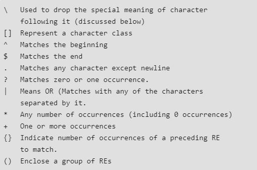

# :zap: Python 101: Beginners Guide to Python Programming📖

    <b>A Complete Guide On Python</b>

## Table of Contents

* <a href="#Introduction">Introduction</a>
* <a href="#Installation">Installation</a>
* <a href="#Basics">Basics</a>
* <a href="#Comments">Comments</a>
* <a href="#Operators">Operators</a>
* <a href="#Conditions">Conditions</a>
* <a href="#Loops">Loops</a>
* <a href="#Datatypes">Datatypes</a>
* <a href="#Functions">Functions</a>
* <a href="#Classes">Classes</a>
* <a href="#RegularExpression">Regular Expression</a>
* <a href="#FileHandling">File Handling</a>
* <a href="#Resources">Resources</a>
* <a href="#Courses">Courses</a>
* <a href="#Youtube">Youtube Channels</a>
* <a href="#Projects">Project Ideas</a>
* <a href="#Practice">Practice Problems</a>
* <a href="#Books">Books</a>

___

### <a name="Introduction">Introduction</a>

Python is developed by Guido van Rossum in 1991 and further developed by the Python Software Foundation. It is a widely-used general-purpose, high-level programming language. It was designed with an emphasis on code readability, and its syntax allows programmers to express their concepts in fewer lines of code. Python is a programming language that lets you work quickly and integrate systems more efficiently.

 [Interesting fact: Python is named after the comedy television show Monty Python’s Flying Circus. It is not named after the Python snake.]

**Advantages :**
1) Presence of third-party modules
2) Extensive support libraries(NumPy for numerical calculations, Pandas for data analytics etc)
3) Open source and community development
4) Easy to learn
5) User-friendly data structures
6) High-level language
7) Dynamically typed language(No need to mention data type based on value assigned, it takes data type)
8) Object-oriented language
9) Portable and Interactive
10) Portable across Operating systems

**Applications :**
1) GUI based desktop applications(Games, Scientific Applications)
2) Web frameworks and applications
3) Enterprise and Business applications
4) Operating Systems
5) Language Development
6) Prototyping
___

### <a name="Installation">Installation</a>

This versatile programming language has two versions: Python 2 and Python 3. Wiki says: Python 2.x is legacy, Python 3.x is the present and future of the language. That is, Python 2 is no longer in development and all new features will be added in Python 3.
You can install Python on any operating system such as Windows, Mac OS X, Linux/Unix and others. To install the Python on your operating system, go to this link: https://www.python.org/downloads/. You will see a screen like this.
  

It is possible to write Python in an Integrated Development Environment, such as Jupiter notebook, Thonny, Pycharm, Netbeans or Eclipse which are particularly useful when managing larger collections of Python files.
___

### <a name="Basics">Basics</a>

In Python , input() function is used for user’s input and print() for output.

For more details visit

- [GeeksForGeeks Inputs](https://www.geeksforgeeks.org/taking-input-in-python/)

____

### <a name="Comments">Comments</a>

**There are two types of comments in Python.**
1. Single line comment
2. Multiple line comments

**1. Single line comment**
In python, we use # special character to start the comment.  
**2. Multi-line comment**
To have a multi-line comment in Python, we use triple single quotes at the beginning and at the end of the comment.
  

___

### <a name="Operators">Operators</a>

Operators are used to perform operations on variables and values.
Python divides the operators in the following groups:
* Arithmetic operators
* Assignment operators
* Comparison operators
* Logical operators
* Identity operators
* Membership operators
* Bitwise operators

To learn more visit sites below : (along with problems for practice)

- [Mindmaijix for Operators](https://mindmajix.com/python/basic-operators-in-python)
- [W3Schools for Operators](https://www.w3schools.com/python/python_operators.asp)
- [GeeksForGeeks for Operators](https://www.geeksforgeeks.org/python-operators/)

___

### <a name="Conditions">Conditions</a>

**If statement**
An "if statement" is written by using the if keyword.

**Elif**
The elif keyword is Python's way of saying "if the previous conditions were not true, then try this condition".

**Else**
The else keyword catches anything which isn't caught by the preceding conditions.

**Nested If**
You can have if statements inside if statements, this is called nested if statements.

To learn more visit sites below :

- [PythonDocs for Conditions](https://docs.python.org/3/tutorial/controlflow.html#if-statements)
- [W3Schools for Conditions](https://www.w3schools.com/python/python_conditions.asp)
- [PythonCourse Site for Conditions](https://www.python-course.eu/python3_conditional_statements.php)

Practice Problems:
- [W3Resource](https://www.w3resource.com/python-exercises/python-conditional-statements-and-loop-exercises.php)
- [Codescope](https://www.codesdope.com/practice/python-decide-ifelse/)

___

### <a name="Loops">Loops</a>

**For Loop**
A for loop is used for iterating over a sequence (that is either a list, a tuple, a dictionary, a set, or a string).This is less like the ’for’ keyword in other programming languages, and works more like an iterator method as found in other object-orientated programming languages.With the for loop we can execute a set of statements, once for each item in a list, tuple, set etc.

**While Loop**
With the while loop we can execute a set of statements as long as a condition is true.

**Break Statement**
With the ‘break’ statement we can stop the loop before it has looped through all the items.

**Continue Statement**
With the continue statement we can stop the current iteration of the loop, and continue with the next.

**Range() Function**
To loop through a set of code a specified number of times, we can use the range() function. The range() function returns a sequence of numbers, starting from 0 by default, and increments by 1 (by default), and ends at a specified number.

To learn more visit sites below :

- [GeeksForGeeks for Loops](https://www.geeksforgeeks.org/python-for-loops/?ref=lbp)
- [W3Schools for Loops](https://www.w3schools.com/python/python_for_loops.asp)
- [PythonCourse Site for Loops](https://www.python-course.eu/python3_for_loop.php)

**Practice Problems:**

- [W3Resource](https://www.w3resource.com/python-exercises/python-conditional-statements-and-loop-exercises.php)
- [Pynative](https://pynative.com/python-if-else-and-for-loop-exercise-with-solutions/)

___

### <a name="Datatypes">Datatypes</a>

1. String

   String is a sequence of characters in Python. The data type of String in Python is called “str”. Strings in Python are either enclosed with single quotes or double quotes. Like many other popular programming languages, strings in Python are arrays of bytes representing unicode characters.However, Python does not have a character data type, a single character is simply a string with a length of 1. Square brackets can be used to access elements of the string.
   
To learn more visit sites below :

- [GeeksForGeeks for Strings](https://www.geeksforgeeks.org/python-strings/?ref=lbp)
- [W3Schools for Strings](https://www.w3schools.com/python/python_strings.asp)
- [BeginnersBook for Strings](https://beginnersbook.com/2018/02/python-strings/)

**Practice Problems:**

- [W3Resource](https://www.w3resource.com/python-exercises/string/)
- [Pynative](https://pynative.com/python-string-exercise/)

2. List

Lists are just like dynamic sized arrays, declared in other languages (vector in C++ and ArrayList in Java). Lists need not be homogeneous always which makes it a most powerful tool in Python. A single list may contain DataTypes like Integers, Strings, as well as Objects. Lists are mutable, and hence, they can be altered even after their creation. List in Python are ordered and have a definite count. The elements in a list are indexed according to a definite sequence and the indexing of a list is done with 0 being the first index. Each element in the list has its definite place in the list, which allows duplicating of elements in the list, with each element having its own distinct place and credibility. In Python lists are written with square brackets.

To learn more visit sites below :

- [Tutorialspoint for Lists](https://www.tutorialspoint.com/python/python_lists.htm)
- [W3Schools for Lists](https://www.w3schools.com/python/python_lists.asp)
- [BeginnersBook for Lists](https://beginnersbook.com/2018/02/python-list/)

**Practice Problems:**

- [W3Resource](https://www.w3resource.com/python-exercises/list/)
- [Pynative](https://pynative.com/python-list-exercise-with-solutions/)

3. Tuples

Tuple is a collection of Python objects much like a list. The sequence of values stored in a tuple can be of any type, and they are indexed by integers. Values of a tuple are syntactically separated by ‘commas’. Although it is not necessary, it is more common to define a tuple by closing the sequence of values in parentheses. This helps in understanding the Python tuples more easily. In Python, tuples are created by placing sequence of values separated by ‘comma’ with or without the use of parentheses for grouping of data sequence.

 [Note – Creation of Python tuple without the use of parentheses is known as Tuple Packing.]

To learn more visit sites below :

- [BeginnersBook for Tuples](https://beginnersbook.com/2018/02/python-tuple/)
- [Tutorialspoint for Tuples](https://www.tutorialspoint.com/python/python_tuples.htm)
- [W3Schools for Tuples](https://www.w3schools.com/python/python_tuples.asp)

**Practice Problems:**

- [W3Resource](https://www.w3resource.com/python-exercises/tuple/)
- [Pynative](https://pynative.com/python-tuple-exercise-with-solutions/)

4. Sets

In Python, Set is an unordered collection of data type that is iterable, mutable and has no duplicate elements. The order of elements in a set is undefined though it may consist of various elements. The major advantage of using a set, as opposed to a list, is that it has a highly optimized method for checking whether a specific element is contained in the set.
Sets can be created by using the built-in set() function with an iterable object or a sequence by placing the sequence inside curly braces, separated by ‘comma’.

 [Note – A set cannot have mutable elements like a list, set or dictionary, as its elements.]

To learn more visit sites below :

- [GeeksForGeeks for Sets](https://www.geeksforgeeks.org/python-sets/?ref=lbp)
- [Tutorialspoint for Sets](https://www.tutorialspoint.com/python_data_structure/python_sets.htm)
- [W3Schools for Sets](https://www.w3schools.com/python/python_sets.asp)

**Practice Problems:**

- [W3Resource](https://www.w3resource.com/python-exercises/sets/)
- [Pynative](https://pynative.com/python-set-exercise-with-solutions/)

5. Dictionary

Dictionary in Python is an unordered collection of data values, used to store data values like a map, which unlike other Data Types that hold only single value as an element, Dictionary holds key:value pair. Key value is provided in the dictionary to make it more optimized.

 [Note – Keys in a dictionary doesn’t allow Polymorphism.]
 
In Python, a Dictionary can be created by placing sequence of elements within curly {}braces, separated by ‘comma’. Dictionary holds a pair of values, one being the Key and the other corresponding pair element being its Key:value. Values in a dictionary can be of any datatype and can be duplicated, whereas keys can’t be repeated and must be immutable.

 [Note – Dictionary keys are case sensitive, same name but different cases of Key will be treated distinctly.]
 
To learn more visit sites below :

- [GeeksForGeeks for Dictionary](https://www.geeksforgeeks.org/python-dictionary/)
- [Tutorialspoint for Dictionary](https://www.tutorialspoint.com/python/python_dictionary.htm)
- [W3Schools for Dictionary](https://www.w3schools.com/python/python_dictionaries.asp)

**Practice Problems:**

- [W3Resource](https://www.w3resource.com/python-exercises/dictionary/)
- [Pynative](https://pynative.com/python-dictionary-exercise-with-solutions/)

___

### <a name="Functions">Functions</a>

A function is a set of statements that take inputs, do some specific computation and produces output. The idea is to put some commonly or repeatedly done task together and make a function, so that instead of writing the same code again and again for different inputs, we can call the function.
Python provides built-in functions like print(), etc. but we can also create your own functions. These functions are called user-defined functions.

To learn more visit sites below :

- [BeginnersBook for Functions](https://beginnersbook.com/2018/01/python-functions/)
- [W3Schools for Functions](https://www.w3schools.com/python/python_functions.asp)
- [GeeksForGeeks for Functions](https://www.geeksforgeeks.org/functions-in-python/)

**Practice Problems:**

- [W3Resource](https://www.w3resource.com/python-exercises/python-functions-exercises.php)
- [Pynative](https://pynative.com/python-functions-exercise-with-solutions/)

___

### <a name="Classes">Classes</a>

A class is a user-defined blueprint or prototype from which objects are created. Classes provide a means of bundling data and functionality together. Creating a new class creates a new type of object, allowing new instances of that type to be made. Each class instance can have attributes attached to it for maintaining its state. Class instances can also have methods (defined by its class) for modifying its state.Class creates a user-defined data structure, which holds its own data members and member functions, which can be accessed and used by creating an instance of that class. A class is like a blueprint for an object.

* Classes are created by keyword class.
* Attributes are the variables that belong to class.
* Attributes are always public and can be accessed using dot (.) operator. Eg.: Myclass.Myattribute

To learn more visit sites below :

- [PythonDocs for Classes](https://docs.python.org/3/tutorial/classes.html)
- [W3Schools for Classes](https://www.w3schools.com/python/python_classes.asp)
- [Beginnersbook for Classes](https://beginnersbook.com/2018/03/python-class-and-objects/)

**Practice Problems:**

- [W3Resource](https://www.w3resource.com/python-exercises/class-exercises/)
- [Codescope](https://www.codesdope.com/practice/python-your-class/)

---

### <a name="RegularExpression">Regular Expression</a>

Regular expressions are a powerful language for matching text patterns. This page gives a basic introduction to regular expressions themselves sufficient for our Python exercises and shows how regular expressions work in Python. The Python "re" module provides regular expression support.  

To understand the RE analogy, MetaCharacters are useful, important and will be used in functions of module re.There are a total of 14 metacharacters as listed below :

To learn more visit sites below :

- [GeeksForGeeks for RegularExpression-I](https://www.geeksforgeeks.org/regular-expression-python-examples-set-1/?ref=lbp)
- [GeeksForGeeks for RegularExpression-II](https://www.geeksforgeeks.org/regular-expressions-python-set-1-search-match-find/?ref=lbp)
- [Developers site for RegularExpression](https://developers.google.com/edu/python/regular-expressions)

**Practice Problems:**

- [W3Resource](https://www.w3resource.com/python-exercises/re/)

___

### <a name="FileHandling">File Handling</a>

File handling is an important part of any web application.Python has several functions for creating, reading, updating, and deleting files.We use open () function in Python to open a file in read or write mode. As explained above, open ( ) will return a file object. To return a file object we use open() function along with two arguments, that accepts file name and the mode, whether to read or write. So, the syntax being: open(filename, mode). 

There are three kinds of mode, that Python provides and how files can be opened:
* “ r “, for reading.
* “ w “, for writing.
* “ a “, for appending.
* “ r+ “, for both reading and writing

To learn more visit sites below :

- [TutorialsPoint for File Handling](https://www.tutorialspoint.com/python/python_files_io.htm)
- [W3Schools for File Handling](https://www.w3schools.com/python/python_file_handling.asp)
- [GeeksForGeeks for File Handling](https://www.geeksforgeeks.org/file-handling-python/)

**Practice Problems:**

- [W3Resource](https://www.w3resource.com/python-exercises/file/)
- [Codescope](https://www.my-courses.net/2020/03/exercise-on-python-files-io.html)

___

### <a name="Resources">Resources</a>

- [Beginnersbook](https://beginnersbook.com/2018/03/python-tutorial-learn-programming/)
- [W3Schools](https://www.w3schools.com/python/)
- [GeeksForGeeks](https://www.geeksforgeeks.org/python-programming-language/)

___

### <a name="Courses">Courses</a>

- [Coursera](https://www.coursera.org/learn/python)
- [EdX](https://www.edx.org/course/introduction-to-computer-science-and-programming-7)
- [Udemy](https://www.udemy.com/topic/python/)

---

### <a name="Youtube">Youtube Channels</a>

- [Python By Sentdex](https://www.youtube.com/playlist?list=PLQVvvaa0QuDe8XSftW-RAxdo6OmaeL85M)
- [Python By Telusko](https://youtu.be/QXeEoD0pB3E)

---

### <a name="Projects">Projects Ideas</a>

- [UpGrad](https://www.upgrad.com/blog/python-projects-ideas-topics-beginners/)
- [Hackr](https://hackr.io/blog/python-projects)
- [Javarevisited](https://medium.com/javarevisited/8-projects-you-can-buil-to-learn-python-in-2020-251dd5350d56)

___

### <a name="Practice">Practice Problems</a>

- [W3Resource](https://www.w3resource.com/python-exercises/?passed=passed)
- [Hackerrank](https://www.hackerrank.com/domains/python)
- [Edabit](https://edabit.com/challenges/python3)

___

### <a name="Books">Books</a>

- [A Byte of Python- Gitbook](https://python.swaroopch.com/)
- [Learning with Python- Green Tea Press](http://greenteapress.com/thinkpython/thinkCSpy/thinkCSpy.pdf)
- [Python Programming- Adam Stewart](https://www.pdfdrive.com/python-programming-python-programming-for-beginners-python-programming-for-intermediates-e180663309.html
)

___

**How to Contribute**
---
1. Clone repo and create a new branch: `$ git checkout https://github.com/CSI-SFIT/Beginners-guide-to-Python-101.git -b name_for_new_branch`.
2. Make changes and test.
3. Submit Pull Request with comprehensive description of changes.

**Acknowledgements**
---

**CSI SFIT Tech Team 2020 - 2021 :**
+ Tech Executive : [@EktaMasrani](https://github.com/ekta18)
+ Tech Executive : [@SomnathPratik](https://github.com/somnathpratik)

 

  

